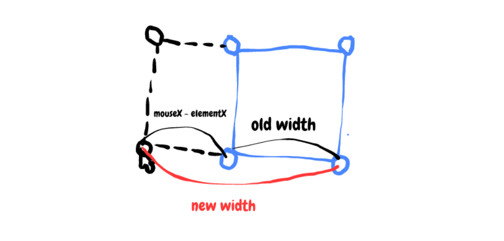
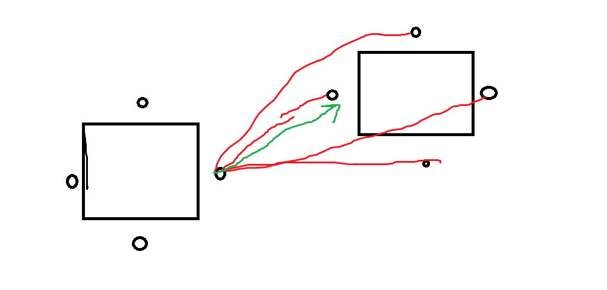

# O implementácii

Pri implementovaní riešenia som sa rozhodol použiť **Vue.js 3** & **Options API**. V komponentoch som použil emitovanie akcií rodičovskému komponentu, pretože som sa od chalanov na pohovore dopočul, že nepoužívate VueX / Pinia.

Mojim cieľom nebolo zadanie zbúchať za čo najkratšiu dobu ale dosiahnuť čo najviac smooth & user friendly experience. To či sa mi to podarilo už posúdi každý sám 👨‍⚖️.
Budem veľmi rád za akýkoľvek feedback.

Celkovo mi zadanie zabralo na vypracovanie okolo 25 hodín.

## 02.09.2022 [čas: 3h]

V tento deň sa mi podarilo dokončiť level 0. Implementoval som teda:

- základný layout stránky
- štýly pre statické poznámky
- pridávanie poznámok pomocou tlačidla na spodnej časti obrazovky
- odstránenie poznámok
- premiestňovanie poznámok pomocou ťahania (not smooth chcelo to fix)

## 03.09.2022 [čas: 6h]

- Najprv som sa rozhodol fixnúť bug z minulého dňa. Pri ťahaní poznámky @mousemove detekuje len pohyb vrámci daného elementu a akonáhle sa kurzor dostal mimo neho, tak sa premiestňovanie zastavilo.
- Ďalej som nakodil možnosť pridávania emojis z výberu uloženého v poli reťazcov.
- Väčšinu času som ale strávil pri implementovaní resizingu zo štyroch rohových bodov, ktoré som vrámci tohto dňa dokončil. To bola zábava na precvičenie skicar skills vzhľadom na to, že resizing vľavo a dohora vyžaduje aj určenie nových x,y pozícií.



Za tento deň som teda spojazdnil level 2, neskôr som sa rozhodol ešte pridať vertikálne a horizontálne resizovanie.

## 04.09.2022 [čas: 2h]

Implementoval som:

- vizualny prvok pre aktívny resizer
- kontrolu prekročenia minimálnej veľkosti daného objektu (note/emoji) pri resizovaní

Začal som trochu rozmýšľať nad tým ako by bolo najvhodnejšie implementovať connections medzi poznámkami. Po chvíľke som dospel k tomu, že najšikovnejšie bude keď použijem svg line so šipkou na konci.

Neskôr som si ešte všimol, že v zadaní resizing nemal byť aj pre emojis ale keď som ho už mal nakódený tak prečo nie 😁

## 05.09.2022 [čas: 9h]

V tento deň som mal k dispozícií 6h času vo vlaku Košice -> Bratislava na nakódenie spojenia. Začal som teda logikou ako sa spojenie bude správať a vytvárať, teda z ktorého bodu do ktorého pre dve dané poznámky.
Rozhodol som sa, že user friendly spôsob by mohol byť počítať vzdialenosť zo 4 bodov (stred vrchnej časti, stred ľavej časti, atď..) prvej poznámky do 4 bodov druhej poznámky a na základe najmenšiej vzdialenosti vytvoriť medzi tymito 2 bodmi spojenie (svg line).



- Ako ďalšie som implementoval to aby sa spojenie vymazalo ak sa vymaže jedna z poznámok a taktiež samotný spôsob ako sa bude spojenie vytvárať. Teda kliknem na ikonku spájania v poznámke -> začne sa vytváranie spojenia -> kliknem na druhu poznamku -> spojenie vytvorene.
- User ale ešte nemal feedback na to ako vlastne to spojenie bude vyzerať ked ho vytváral, preto som pridal vizuálny prvok dočasného spojenia ktoré smeruje ku kurzoru. Neskôr v ten istý deň som k tomu pridal ešte vizualne zobrazenie pred dokončením spojenia pri hoveri nad poznamkou.
- Potom som nakódil to aby používateľ mohol vypnúť vytváranie spojenia ak si to rozmyslel. Pomocou stlačenia klávesy ESC alebo opätovného kliknutia na ikonku spájania.
- Neskôr som pridal možnosť vytvoriť rekurzívne spojenie kedy ma poznamka connection sama na seba, neviem či by to niekto v živote použil ale chýbalo mi to tam 😁
- Zakončil som to vytvorením základných štýlov pre horizontal / vertikálne menenie veľkosti, ktoré som chcel dokončiť na ďalší deň.

## 06.09.2022 [čas: 6h]

- Pridal som horizontálne a vertikálne resizovanie.
- Pridal som pop-up okno vrámci, ktorého si môže používateľ vybrať farbu poznámky a emoji.
- Konečne som vymyslel a implementoval ako by bolo najvhodnejšie aby sa správali poznámky vrámci tabule a kedy by sa mali poznámky/emotikony dostať do popredia nad ostatné.
- Refaktoring – v tomto momente som bol spokojný s funkcionalitou riešenia a pár hodin som venoval refaktoringu. Bolo by síce vhodné ešte vrámci škálovateľnosti riešenia vytvoriť spoločny array pre všetky whiteboard objekty. Zbaviť sa duplicity vrámci polôh a dimenzii pre whiteboard modely a viac dekomponovať WhiteBoard.vue. Myslím si ale, že kód je veľmi ľahko čitateľný a okomentovaný a preto to sú už len detaily, ktoré by bolo nutné spraviť ak by sa jednalo o reálny projekt. Na predvedenie schopností bolo podľa mňa dostatočne veľa priestoru 🧡.

# Run & Enjoy

```sh
git clone https://github.com/JSimko4/ayanza-zadanie
```

```sh
cd ayanza-zadanie
```

```sh
npm install
```

```sh
npm run dev
```
